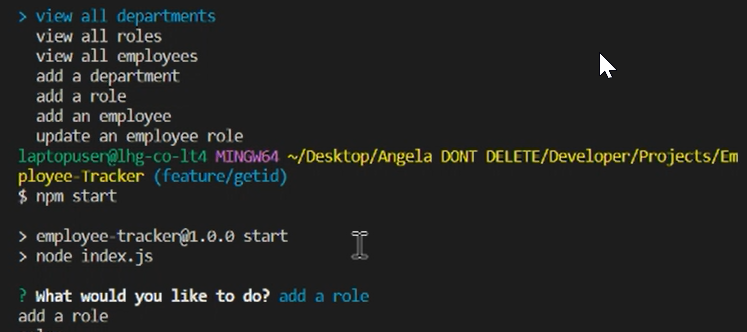

# Employee Tracker

  

## Table-of-Contents

  * [Description](#description)
  * [UserStory](#userstory)
  * [Installation](#installation)
  * [Usage](#usage)
  * [License](#license)
  * [Tests](#tests)
  * [Questions](#questions)
  * [Contributers](#contributers)
  

  ## [Description:](#table-of-contents)

  #### Application that lets you view all departments, roles, employees, and related fields, as well as make changes to them.

   ## [UserStory](#table-of-contents)

AS A business owner
I WANT to be able to view and manage the departments, roles, and employees in my company
SO THAT I can organize and plan my business

  ## [Installation](#table-of-contents)

  #### MySQL, Inquirer, node.js

  ## [Usage](#table-of-contents)

  #### Use in terminal and start by using npm start and following prompts.

  Click [here](https://drive.google.com/file/d/1htI1H2D4MX7GqBuHd-XB0lh2wHbPwfgj/view) for video.
  

  
  ## License
    
  The application is covered under the following license:
    
  
  
    

  ## [Tests](#table-of-contents)

  #### in VS Code in terminal.

  ## [Questions](#table-of-contents)

  Please contact me using the following links:
  

  * [GitHub](http://github.com/angealgola-ko)

  * [Email: angelagola.ko@gmail.com](mailto:angelagola.ko@gmail.com)

  ## [Contributers](#table-of-contents)

  * Angela Gola &copy;2022 All Rights Reserved.